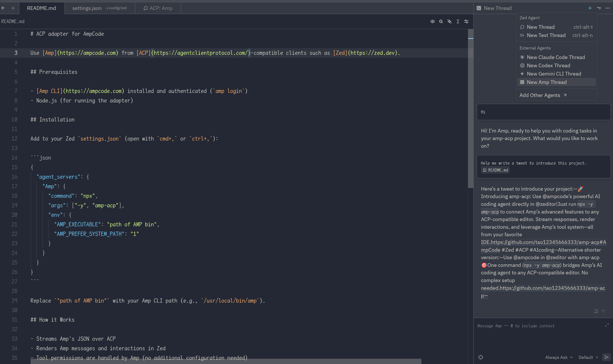

# ACP adapter for AmpCode



Use [Amp](https://ampcode.com) from [ACP](https://agentclientprotocol.com/)-compatible clients such as [Zed](https://zed.dev) or [Toad](https://github.com/batrachianai/toad).

## Prerequisites

- Node.js 18+ (the adapter will be installed automatically via `npx`)

## Installation

Add to your Zed `settings.json` (open with `cmd+,` or `ctrl+,`):

```json
{
  "agent_servers": {
    "Amp": {
      "command": "npx",
      "args": ["-y", "amp-acp"]
    }
  }
}
```

That's it! The SDK handles authentication and Amp integration automatically.

## First Use

**If you don't have Amp CLI installed**: Add the `AMP_API_KEY` environment variable to your Zed config. You can get your API key from https://ampcode.com/settings

```json
{
  "agent_servers": {
    "Amp": {
      "command": "npx",
      "args": ["-y", "amp-acp"],
      "env": {
        "AMP_API_KEY": "your-api-key-here"
      }
    }
  }
}
```

**If you [have Amp CLI installed](https://ampcode.com/manual#getting-started-command-line-interface)**: Run `amp login` first to authenticate.

## How it Works

- Uses the official Amp SDK to communicate with AmpCode
- Streams Amp's responses over the Agent Client Protocol (ACP)
- Renders Amp messages and interactions natively in Zed
- Tool permissions are handled by Amp (no additional configuration needed)
- Supports conversation continuity across multiple prompts

## Troubleshooting

**Adapter doesn't start**: Make sure you have Node.js 18 or later installed. Run `node --version` to check.

**Connection issues**: Restart Zed and try again. The adapter creates a fresh connection each time.

**Tool execution problems**: Check Zed's output panel for detailed error messages from the Amp SDK.
