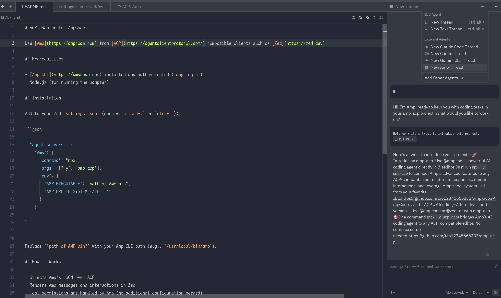
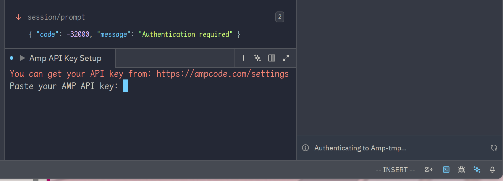

# ACP adapter for Amp

[](https://github.com/tao12345666333/amp-acp/actions/workflows/ci.yml)
[](https://www.npmjs.com/package/amp-acp)



Use [Amp](https://ampcode.com) from [ACP](https://agentclientprotocol.com/)-compatible clients such as [Zed](https://zed.dev) or [Toad](https://github.com/batrachianai/toad).

## Prerequisites

amp-acp uses the Amp CLI as its default execution runtime. Install the [latest Amp CLI](https://ampcode.com/manual#get-started), sign in, and verify it is available before installing the adapter:

```bash
amp login
amp --version
```

If your editor does not inherit your shell `PATH`, set `AMP_CLI_PATH` to the absolute path printed by `command -v amp` (macOS/Linux) or `where amp` (Windows).

## Installation

### Option 1: Zed ACP Registry (Recommended)

Install Amp directly from Zed's ACP Registry:

1. In Zed, open the **Agent Panel**
2. Click **+**, then select **+ Add More Agents**
3. Search for **Amp** and install it

Zed will automatically download the correct binary for your platform.

### Option 2: Pre-built Binary

Download the adapter binary from the [GitHub Releases](https://github.com/tao12345666333/amp-acp/releases) page. The adapter itself has no JavaScript runtime dependency, but the Amp CLI described above is required for agent execution.

| Platform | Architecture | Binary |
|----------|-------------|--------|
| Linux | x64 | `amp-acp-linux-x64` |
| Linux | arm64 | `amp-acp-linux-arm64` |
| macOS | x64 (Intel) | `amp-acp-darwin-x64` |
| macOS | arm64 (Apple Silicon) | `amp-acp-darwin-arm64` |
| Windows | x64 | `amp-acp-windows-x64.exe` |

Download the binary for your platform, make it executable (`chmod +x` on Linux/macOS), and add to your Zed `settings.json` (open with `cmd+,` or `ctrl+,`):

```json
{
  "agent_servers": {
    "Amp": {
      "type": "custom",
      "command": "/path/to/amp-acp-darwin-arm64",
      "env": {
        "AMP_CLI_PATH": "/absolute/path/to/amp"
      }
    }
  }
}
```

### Option 3: npx

```json
{
  "agent_servers": {
    "Amp": {
      "type": "custom",
      "command": "npx",
      "args": ["-y", "amp-acp"],
      "env": {
        "AMP_CLI_PATH": "/absolute/path/to/amp"
      }
    }
  }
}
```

Requires Node.js 18+.

## Authentication

Run `amp login` before starting amp-acp. The adapter and CLI share the same Amp credentials. For headless environments, `AMP_API_KEY` is also supported. `amp-acp --setup` remains available as an interactive API-key setup fallback.



## Features

- **Streaming responses** — Amp messages, tool calls, and thinking are streamed in real-time via ACP
- **Image support** — Handles image content blocks from Amp (base64 and URL)
- **MCP passthrough** — MCP servers configured in Zed are automatically passed through to Amp
- **Session configuration** — Configure permissions (*Default* or *Bypass*) and the current Amp mode (`low`, `medium`, `high`, or `ultra`) via ACP config options
- **`/init` command** — Type `/init` to generate an `AGENTS.md` file for your project
- **Conversation continuity** — Thread context is preserved across multiple prompts within a session

### Continuing the latest thread on session start

When the environment variable `AMP_ACP_CONTINUE_LATEST=1` is set, the first prompt in a fresh ACP session will continue the most recent Amp thread on this installation (equivalent to `amp threads continue`) instead of starting a new one. Useful when the ACP session follows on from prior `amp` CLI activity (for example, a one-shot `amp -x` invocation) and you want the chat to inherit that context. Off by default.

### Amp execution transport

By default, amp-acp executes the installed Amp CLI directly through its streaming JSON interface. Set `AMP_ACP_TRANSPORT=sdk` to use `@ampcode/sdk` as a compatibility fallback; both transports support the current `low`, `medium`, `high`, and `ultra` Amp modes.

## MCP Configuration Passthrough

MCP servers configured in Zed's `context_servers` are automatically forwarded to Amp. This is compatible with how other ACP agents like [Claude Code](https://github.com/zed-industries/claude-code-acp) and [Codex](https://github.com/zed-industries/codex-acp) handle MCP servers.

### Supported MCP Server Types

| Type | Description | Example |
|------|-------------|---------|
| **stdio** | Local command-line MCP servers | `@playwright/mcp`, `@modelcontextprotocol/server-filesystem` |
| **HTTP** | Remote HTTP MCP servers | `https://mcp.exa.ai/mcp` |
| **SSE** | Remote Server-Sent Events MCP servers | `https://mcp.monday.com/sse` |

### Example: Using Exa Search with Amp

```json
{
  "agent_servers": {
    "Amp": {
      "type": "custom",
      "command": "npx",
      "args": ["-y", "amp-acp"]
    }
  },
  "context_servers": {
    "exa": {
      "url": "https://mcp.exa.ai/mcp"
    }
  }
}
```

### Example: Multiple MCP Servers

```json
{
  "agent_servers": {
    "Amp": {
      "type": "custom",
      "command": "npx",
      "args": ["-y", "amp-acp"]
    }
  },
  "context_servers": {
    "playwright": {
      "command": "npx",
      "args": ["-y", "@playwright/mcp@latest", "--headless"]
    },
    "filesystem": {
      "command": "npx",
      "args": ["-y", "@modelcontextprotocol/server-filesystem", "/path/to/allowed"]
    },
    "github": {
      "command": "npx",
      "args": ["-y", "@modelcontextprotocol/server-github"],
      "env": {
        "GITHUB_PERSONAL_ACCESS_TOKEN": "your-token"
      }
    }
  }
}
```

For more details, see [docs/mcp-passthrough.md](docs/mcp-passthrough.md).

## Development

```bash
bun install
bun run build        # Bundle to dist/index.js
bun run lint         # Type-check with tsc
bun test src/        # Run unit tests
bun run test:binary  # Run binary integration and ACP client E2E tests
bun run test:all     # Run all tests
```

The regular suite uses a deterministic fake CLI and is safe for CI. Maintainers can additionally verify the complete path against their installed, authenticated Amp CLI:

```bash
AMP_ACP_LIVE_E2E=1 AMP_ACP_REAL_CLI_PATH="$(command -v amp)" bun run test:e2e:real
```

This opt-in test is never enabled by CI. It creates a temporary workspace, runs two short prompts in `low` mode, verifies streaming and same-thread continuation through the official ACP client SDK, and consumes a small amount of Amp usage.

## Troubleshooting

**Adapter doesn't start**: Make sure you have Node.js 18+ (for `npx`) or use a pre-built binary / Zed extension instead.

**Connection issues**: Restart Zed and try again. The adapter creates a fresh connection each time.

**Amp CLI not found**: Run `amp --version` in a terminal. If it works there but not in your editor, set `AMP_CLI_PATH` to the absolute CLI path in the agent server environment.

**Tool execution problems**: Check Zed's output panel for detailed errors from the Amp CLI.

**MCP server not connecting**: Ensure the MCP server command is correct and any required environment variables are set. Check Zed's logs for connection errors.

## License

[Apache-2.0](https://opensource.org/licenses/Apache-2.0)
