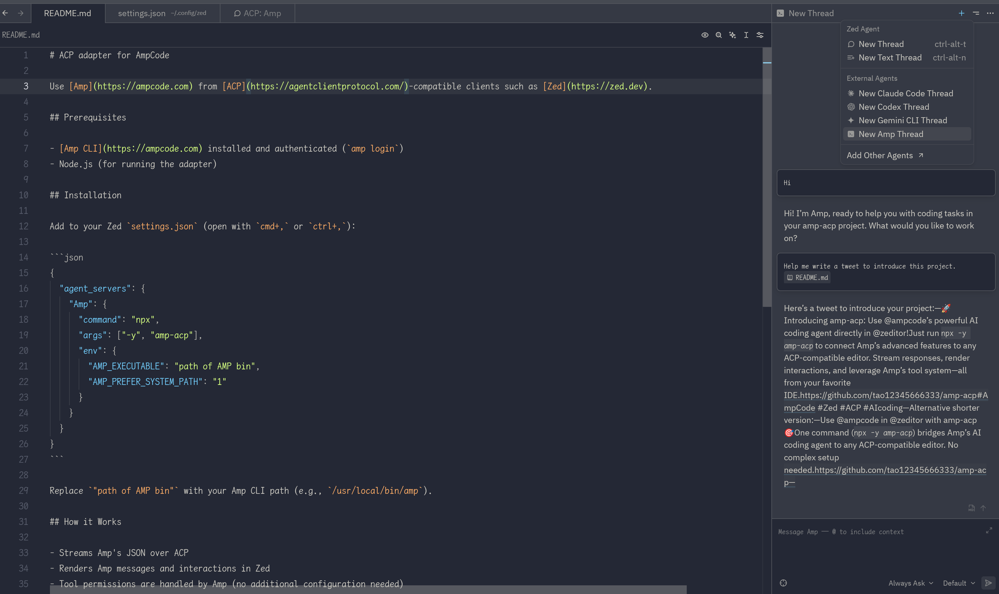
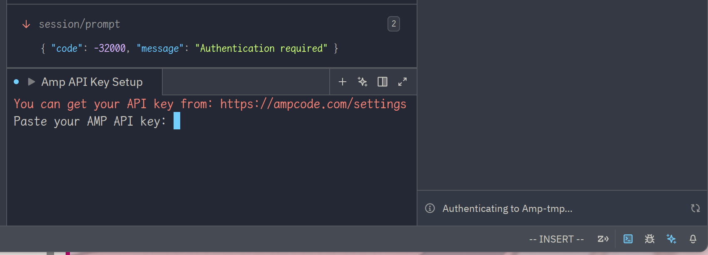

# ACP adapter for Amp

[](https://github.com/tao12345666333/amp-acp/actions/workflows/ci.yml)
[](https://www.npmjs.com/package/amp-acp)



Use [Amp](https://ampcode.com) from [ACP](https://agentclientprotocol.com/)-compatible clients such as [Zed](https://zed.dev) or [Toad](https://github.com/batrachianai/toad).

## Prerequisites

amp-acp uses the Amp CLI as its default execution runtime. Install the [latest Amp CLI](https://ampcode.com/manual#get-started), sign in, and verify it is available before installing the adapter:

```bash
amp login
amp --version
```

If your editor does not inherit your shell `PATH`, set `AMP_CLI_PATH` to the absolute path printed by `command -v amp` (macOS/Linux) or `where amp` (Windows).

## Installation

### Option 1: Zed ACP Registry (Recommended)

Install Amp directly from Zed's ACP Registry:

1. In Zed, open the **Agent Panel**
2. Click **+**, then select **+ Add More Agents**
3. Search for **Amp** and install it

Zed will automatically download the correct binary for your platform.

### Option 2: Pre-built Binary

Download the adapter binary from the [GitHub Releases](https://github.com/tao12345666333/amp-acp/releases) page. The adapter itself has no JavaScript runtime dependency, but the Amp CLI described above is required for agent execution.

| Platform | Architecture | Binary |
|----------|-------------|--------|
| Linux | x64 | `amp-acp-linux-x64` |
| Linux | arm64 | `amp-acp-linux-arm64` |
| macOS | x64 (Intel) | `amp-acp-darwin-x64` |
| macOS | arm64 (Apple Silicon) | `amp-acp-darwin-arm64` |
| Windows | x64 | `amp-acp-windows-x64.exe` |

Download the binary for your platform, make it executable (`chmod +x` on Linux/macOS), and add to your Zed `settings.json` (open with `cmd+,` or `ctrl+,`):

```json
{
  "agent_servers": {
    "Amp": {
      "type": "custom",
      "command": "/path/to/amp-acp-darwin-arm64",
      "env": {
        "AMP_CLI_PATH": "/absolute/path/to/amp"
      }
    }
  }
}
```

### Option 3: npx

```json
{
  "agent_servers": {
    "Amp": {
      "type": "custom",
      "command": "npx",
      "args": ["-y", "amp-acp"],
      "env": {
        "AMP_CLI_PATH": "/absolute/path/to/amp"
      }
    }
  }
}
```

Requires Node.js 18+.

## Authentication

Run `amp login` before starting amp-acp. The adapter and CLI share the same Amp credentials. For headless environments, `AMP_API_KEY` is also supported. `amp-acp --setup` remains available as an interactive API-key setup fallback.



## Features

- **Streaming responses** — Amp messages, tool calls, and thinking are streamed in real-time via ACP
- **Image support** — Handles image content blocks from Amp (base64 and URL)
- **MCP passthrough** — MCP servers configured in Zed are automatically passed through to Amp
- **Session configuration** — Choose local or Orb execution, configure permissions (*Default* or *Bypass*), and select the current Amp mode via ACP config options: the built-in `low`, `medium`, `high`, and `ultra` modes, plus any agent modes registered by locally installed Amp plugins (such as `grok45` from `@amp/grok-45-mode`)
- **`/init` command** — Type `/init` to generate an `AGENTS.md` file for your project
- **Conversation continuity** — Thread context is preserved across multiple prompts within a session
- **Session resume** — `session/load` reattaches to the underlying Amp thread after amp-acp restarts, so ACP clients can reopen earlier sessions
- **Native thread lifecycle** — ACP clients can persist Amp's durable thread ID and archive or unarchive that exact thread

### Native Amp thread lifecycle extension

Amp's streamed `session_id` is a durable `T-...` thread ID, distinct from amp-acp's `S-...` ACP session ID. amp-acp persists that exact mapping under `$XDG_STATE_HOME/amp-acp/sessions` (or `$AMP_ACP_STATE_DIR/sessions`) so `session/resume`, `session/load`, and native archival remain safe after adapter restarts. It never reconstructs the relationship from a working directory, title, timestamp, or thread listing.

Mappings are small JSON records written atomically to an owner-only state directory (`0700`) with owner-only files (`0600`). They contain the ACP session ID, Amp thread ID, and the session's permission mode, Amp mode, and working directory — never prompts, responses, or credentials.

Compatible ACP clients can detect protocol revision 1 at `agentCapabilities._meta["amp-acp/thread-lifecycle"]` and use these custom methods:

- `amp-acp/session/native-metadata` with `{ "sessionId": "S-..." }` returns `{ "version": 1, "sessionId": "S-...", "ampThreadId": "T-..." | null }`.
- `amp-acp/thread/set-archived` with `{ "sessionId": "S-...", "threadId": "T-...", "archived": true | false }` validates both IDs against the persisted mapping, then invokes `amp threads archive <thread-id>` or `amp threads archive --unarchive <thread-id>` directly without a shell.

Archival is separate from ACP session close. Missing or mismatched mappings fail safely instead of selecting another Amp thread.

Existing ACP clients remain compatible and can ignore the extension metadata. Sessions created before 0.10.0 have no durable mapping, so they cannot be resumed or archived through this extension; starting a new session and completing its first prompt creates the mapping. Inferring a mapping from Amp's latest thread is deliberately forbidden because another CLI, editor, or concurrent session may have created a newer thread. The separate `AMP_ACP_CONTINUE_LATEST=1` option below remains an explicit request to continue the latest thread for a new session, not a lifecycle recovery mechanism.

### Orb execution

Select **Orb** under **Execution Environment** in the ACP session configuration to run the Amp thread in a remote Amp Orb. Orb sessions always use the `@ampcode/sdk` transport, even when local execution uses the default CLI transport.

By default, Amp infers the project from the Git remotes of the directory supplied by the ACP client. Set `AMP_ACP_ORB_PROJECT` to an Amp project reference (`namespace/name`, `owner/repo`, or a repository URL) to override that inference.

Permissions, MCP servers, skills, and enabled tools supplied by the local client do not apply inside an Orb. Configure them on the Amp project instead. Authentication must have access to Amp Orbs and to the selected project.

A gated live end-to-end test exercises this path against a real Amp account: `AMP_ACP_ORB_LIVE_E2E=1 bun run test:e2e:orb`. It creates a session in this repository, switches the execution environment to Orb, and runs one `low`-mode turn. It consumes Amp credits and requires orb access to the project inferred from the git remote.

### Continuing the latest thread on session start

When the environment variable `AMP_ACP_CONTINUE_LATEST=1` is set, the first prompt in a fresh ACP session will continue the most recent Amp thread on this installation (equivalent to `amp threads continue`) instead of starting a new one. Useful when the ACP session follows on from prior `amp` CLI activity (for example, a one-shot `amp -x` invocation) and you want the chat to inherit that context. Off by default.

### Resuming sessions

amp-acp advertises the ACP `loadSession` capability. Once a prompt has started an Amp thread, the ACP session ID is mapped to that thread in the durable session store described above (`$XDG_STATE_HOME/amp-acp/sessions`, one file per session; respects `%LOCALAPPDATA%\amp-acp` on Windows and can be overridden with `AMP_ACP_STATE_DIR`). The store also records the session's permission mode, Amp mode, and execution environment, so when a client calls `session/load`, amp-acp restores those settings and continues the same thread (equivalent to `amp threads continue <id>`), even across amp-acp process restarts.

During `session/load`, prior messages are replayed to the client as `session/update` notifications (user/agent messages, thinking, and tool calls) using `amp threads export`, so the client can rebuild the transcript. Replay is best-effort: if the export fails, the session still loads and the thread still continues with full server-side context.

### Amp execution transport

By default, amp-acp executes the installed Amp CLI directly through its streaming JSON interface. Set `AMP_ACP_TRANSPORT=sdk` to use `@ampcode/sdk` as a compatibility fallback; both transports support the current `low`, `medium`, `high`, and `ultra` Amp modes, plus any plugin agent modes (see below).

### Plugin agent modes

Amp plugins can register custom agent modes with `amp.registerAgentMode(...)` plus a matching `// @amp-agent-mode {"key":"...","label":"..."}` metadata comment in the plugin source (see [Amp's plugin docs](https://ampcode.com/manual#plugins)). Examples include `grok45` from `@amp/grok-45-mode` or any mode listed on the [Modes page](https://ampcode.com/modes) under *Agent Mode Plugins*.

amp-acp auto-discovers these modes by scanning plugin sources and appends them to the Amp Mode selector in your ACP client, so a mode installed via `amp plugins add` shows up immediately — for example, with the Grok 4.5 plugin installed you get:

```text
Amp Mode  [Medium ▾]
  Low
  Medium
  High
  Ultra
  Grok 4.5
```

Discovery covers:

- the system plugin directory (`~/.config/amp/plugins` on macOS/Linux, `%USERPROFILE%\.config\amp\plugins` on Windows), and
- the project plugin directory (`.amp/plugins` under the session's working directory).

Set `AMP_ACP_SYSTEM_PLUGIN_DIR` to point at a different system plugin directory. Plugin modes are passed through as-is to the Amp CLI (`--mode <key>`) or the Amp SDK; Amp rejects keys that do not match a loaded plugin.

## MCP Configuration Passthrough

MCP servers configured in Zed's `context_servers` are automatically forwarded to Amp. This is compatible with how other ACP agents like [Claude Code](https://github.com/zed-industries/claude-code-acp) and [Codex](https://github.com/zed-industries/codex-acp) handle MCP servers.

### Supported MCP Server Types

| Type | Description | Example |
|------|-------------|---------|
| **stdio** | Local command-line MCP servers | `@playwright/mcp`, `@modelcontextprotocol/server-filesystem` |
| **HTTP** | Remote HTTP MCP servers | `https://mcp.exa.ai/mcp` |
| **SSE** | Remote Server-Sent Events MCP servers | `https://mcp.monday.com/sse` |

### Example: Using Exa Search with Amp

```json
{
  "agent_servers": {
    "Amp": {
      "type": "custom",
      "command": "npx",
      "args": ["-y", "amp-acp"]
    }
  },
  "context_servers": {
    "exa": {
      "url": "https://mcp.exa.ai/mcp"
    }
  }
}
```

### Example: Multiple MCP Servers

```json
{
  "agent_servers": {
    "Amp": {
      "type": "custom",
      "command": "npx",
      "args": ["-y", "amp-acp"]
    }
  },
  "context_servers": {
    "playwright": {
      "command": "npx",
      "args": ["-y", "@playwright/mcp@latest", "--headless"]
    },
    "filesystem": {
      "command": "npx",
      "args": ["-y", "@modelcontextprotocol/server-filesystem", "/path/to/allowed"]
    },
    "github": {
      "command": "npx",
      "args": ["-y", "@modelcontextprotocol/server-github"],
      "env": {
        "GITHUB_PERSONAL_ACCESS_TOKEN": "your-token"
      }
    }
  }
}
```

For more details, see [docs/mcp-passthrough.md](docs/mcp-passthrough.md).

## Development

```bash
bun install
bun run build        # Bundle to dist/index.js
bun run lint         # Type-check with tsc
bun test src/        # Run unit tests
bun run test:binary  # Run binary integration and ACP client E2E tests
bun run test:all     # Run all tests
```

The regular suite uses a deterministic fake CLI and is safe for CI. Maintainers can additionally verify the complete path against their installed, authenticated Amp CLI:

```bash
AMP_ACP_LIVE_E2E=1 AMP_ACP_REAL_CLI_PATH="$(command -v amp)" bun run test:e2e:real
```

This opt-in test is never enabled by CI. It creates a temporary workspace, runs two short prompts in `low` mode, verifies streaming and same-thread continuation through the official ACP client SDK, and consumes a small amount of Amp usage.

## Troubleshooting

**Adapter doesn't start**: Make sure you have Node.js 18+ (for `npx`) or use a pre-built binary / Zed extension instead.

**Connection issues**: Restart Zed and try again. The adapter creates a fresh connection each time.

**Amp CLI not found**: Run `amp --version` in a terminal. If it works there but not in your editor, set `AMP_CLI_PATH` to the absolute CLI path in the agent server environment.

**Tool execution problems**: Check Zed's output panel for detailed errors from the Amp CLI.

**MCP server not connecting**: Ensure the MCP server command is correct and any required environment variables are set. Check Zed's logs for connection errors.

## License

[Apache-2.0](https://opensource.org/licenses/Apache-2.0)
